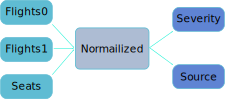

<!-- .slide: data-background-image="butt.jpg" -->

---

<!-- .slide: class="aside" -->

## enum safety

```cpp
///fails=Assertion `isRed(CndRed)' failed
///hide
#include <cassert>

///unhide
enum Color { ClrRed, ClrOrange, ClrYellow, ClrGreen };
enum Alert { CndGreen, CndYellow, CndRed };

bool isRed(Alert alert) {
    return alert == ClrRed;
}

int main(){
    assert(isRed(CndRed)); // oops
}
```


<div class="footnote">

Source: [N2347](https://wg21.link/n2347)

</div>

---

<!-- .slide: class="aside" -->

## enum safety

```cpp []
///options=--short-enums
///fails=static assertion failed
enum Version { Ver1 = 1, Ver2 = 2 };

struct Packet {
 Version ver; // bad, size can vary by implementation
 // … more data …
 Version getVersion() const { return ver; }
};

static_assert(sizeof(Packet) == sizeof(int), "");
```

---

<!-- .slide: class="aside" id="scoped_enums" -->

## scoped enums

```cpp
///hide
#include <cassert>

///unhide
enum class Color { Red, Orange, Yellow, Green };
enum class Alert { Green, Yellow, Red };

bool isRed(Alert alert) {
  // return alert == Color::Red; // doesn't compile
  return alert == Alert::Red;
}

int main(){
  assert(isRed(Alert::Red));
}
```

---

<!-- .slide: class="aside" -->

## sized enums

```cpp [1,9]
///options=--short-enums
enum Version : int { Ver1 = 1, Ver2 = 2 };

struct Packet {
 Version ver; // bad, size can vary by implementation
 // … more data …
 Version getVersion() const { return ver; }
};

static_assert(sizeof(Packet) == sizeof(int), "");
```

---

<!-- .slide: class="aside" -->

C++ Core Guidelines [Enum.3](https://isocpp.github.io/CppCoreGuidelines/CppCoreGuidelines#enum3-prefer-class-enums-over-plain-enums): Prefer class enums over "plain" enums

---

<!-- .slide: -->

## let's fly


<!-- .element: class="r-stretch" -->

<div class="footnote">

Source: [Andrzej's C++ blog](https://akrzemi1.wordpress.com/2017/09/04/using-error-codes-effectively/)

</div>

---

## different error codes

<!-- .slide: -->

```cpp
enum class Flights0Errc
{
  // no 0
  NonexistentLocations = 10,
  DatesInThePast,
  InvertedDates,
  NoFlightsFound       = 20,
  ProtocolViolation    = 30,
  ConnectionError,
  ResourceError,
  Timeout,
};


enum class Flights1Errc
{
  // no 0
  ZeroFlightsFound     = 11,
  InvalidRequestFormat = 12,
  CouldNotConnect      = 13,
  DatabaseError        = 14,
  NotEnoughMemory      = 15,
  InternalError        = 16,
  NoSuchAirport        = 17,
  JourneyInThePast     = 18,
  DatesNotMonotonic    = 19,
};

enum class SeatsErrc
{
  // no 0
  InvalidRequest = 1,
  CouldNotConnect,
  InternalError,
  NoResponse,
  NonexistentClass,
  NoSeatAvailable,
};


```

<!-- .element: class="split" style="column-count: 3" -->

---

## error source

1. User sent us an illogical request.
2. There is some problem with the system which the user will not understand but which prevents us from returning the requested answer.
3. No airline we are aware of is able to offer a requested trip.

---

## error severity

1. A bug.
2. An incorrect configuration.
3. A (perhaps temporary) shortage of resources.
4. Normal (like “no solutions found”) — user may be disappointed, but developers or the system did nothing wrong.

---

<!-- .slide: data-background-image="fixed_it.gif" -->

# error handling

<!-- .element: class="chapter" -->

---

## `std::error_category`

A base class for error domains.

```cpp
///hide
#include <string>

///unhide
namespace std {
  class error_category {
  public:
    virtual const char* name() const noexcept = 0;
    virtual string message(int ev) const = 0;
    // other functions
  };
}
```

---

## defining a category

```cpp [1,3-4,18,21|4-7|9-17|20]
#include <system_error>
///hide
enum class Flights0Errc
{
  // no 0
  NonexistentLocations = 10,
  DatesInThePast,
  InvertedDates,
  NoFlightsFound       = 20,
  ProtocolViolation    = 30,
  ConnectionError,
  ResourceError,
  Timeout,
};
///unhide
 
namespace {
struct Flights0ErrCategory : std::error_category {
  const char* name() const noexcept override {
    return "flights0";
  }

  std::string message(int ev) const override {
    switch (static_cast<Flights0Errc>(ev))
    {
    case Flights0Errc::NonexistentLocations: return "nonexistent airport name in request";
    case Flights0Errc::DatesInThePast: return "request for a date from the past";
    /// etc.
    default: return "(unrecognized error)";
    }
  }
};
 
const Flights0ErrCategory flights0ErrCategory;
} // namespace
```

<!-- .element: style="font-size: 0.35em" -->

`flights0.cpp`

---

<!-- .slide: id="error_code" -->

## `std::error_code`

Error number and category.

```cpp [2,4,11-12|13-14|5-10]
///hide
#include <type_traits>
#include <string>

namespace std {
template<typename>
struct is_error_code_enum : std::false_type {};
}

class error_category;

///unhide
namespace std {
  class error_code {
  public:
    error_code(int val, const error_category& cat) noexcept;
    template<class ErrorCodeEnum, 
             typename = std::enable_if_t<
                          std::is_error_code_enum<
                            ErrorCodeEnum
                          >::value>>
      error_code(ErrorCodeEnum e) noexcept;
    int value() const noexcept;
    const error_category& category() const noexcept;
    string message() const;
    explicit operator bool() const noexcept;
    // other members
  };
}
```

<!-- .element: style="font-size: 0.45em" -->

Note: `operator bool()` returns `value() != 0`

---

## defining an error code

<div class="grid2">

```cpp [1|3-14|16-22|24]
# include <system_error>

enum class Flights0Errc
{
  // no 0
  NonexistentLocations = 10,
  DatesInThePast,
  InvertedDates,
  NoFlightsFound       = 20,
  ProtocolViolation    = 30,
  ConnectionError,
  ResourceError,
  Timeout,
};

namespace std
{
  template <>
  struct is_error_code_enum<Flights0Errc> 
    : true_type 
  {};
}

std::error_code make_error_code(Flights0Errc);
```

<!-- .element: data-fragment-index="0" -->

```cpp [0|0|0|1-4]
///hide
#include <system_error>

enum class Flights0Errc
{
  // no 0
  NonexistentLocations = 10,
  DatesInThePast,
  InvertedDates,
  NoFlightsFound       = 20,
  ProtocolViolation    = 30,
  ConnectionError,
  ResourceError,
  Timeout,
};

namespace std
{
  template <> struct 
  is_error_code_enum<Flights0Errc> 
  : true_type {};
}

struct Flights0ErrCategory : std::error_category {
  const char* name() const noexcept override {
    return "flights0";
  }

  std::string message(int ev) const override {
    return {};
  }

};
const Flights0ErrCategory flights0ErrCategory;

///unhide
std::error_code make_error_code(Flights0Errc e) {
  return {static_cast<int>(e), 
          flights0ErrCategory};
}
```

<!-- .element: data-fragment-index="0" -->

`flights0.hpp`

`flights0.cpp`

</div>

Note: similarly for `Flights1Errc` and `SeatsErrc`

---

## using `std::error_code`

```cpp 
///hide
#include <system_error>
#include <iostream>
#include <cassert>

enum class Flights0Errc
{
  // no 0
  NonexistentLocations = 10,
  DatesInThePast,
  InvertedDates,
  NoFlightsFound       = 20,
  ProtocolViolation    = 30,
  ConnectionError,
  ResourceError,
  Timeout,
};

namespace std
{
  template <> struct 
  is_error_code_enum<Flights0Errc> 
  : true_type {};
}

namespace {
struct Flights0ErrCategory : std::error_category {
  const char* name() const noexcept override {
    return "flights0";
  }

  std::string message(int ev) const override {
    switch (static_cast<Flights0Errc>(ev))
    {
    case Flights0Errc::NonexistentLocations: return "nonexistent airport name in request";
    case Flights0Errc::DatesInThePast: return "request for a date from the past";
    /// etc.
    default: return "(unrecognized error)";
    }
  }
};
 
const Flights0ErrCategory flights0ErrCategory;
} // namespace

std::error_code make_error_code(Flights0Errc e) {
  return {static_cast<int>(e), 
          flights0ErrCategory};
}

#if 0
///unhide
#include "flights0.hpp"
///hide
#endif
///unhide

int main()
{
  std::error_code ec = Flights0Errc::DatesInThePast;
  std::cout << ec << ": " << ec.message() << '\n';
  assert(ec == Flights0Errc::DatesInThePast);
  assert(ec != Flights0Errc::InvertedDates);
}
```

---

## combining system errors

```cpp
enum class SubsystemError
{
    // no 0
    InputBadAirport = 1,
    InputPastDate,
    InputBadDateRange,
    InputBadClass,
    NoFlightFound,
    NoSeatFound,
    SubsysProtocolErr,
    SubsysInternal,
    SubsysResource,
    SubsysConfig,
    SubsysTimeout,
};
```

<!-- .element: style="font-size: 0.5em" -->

---

<!-- .slide: id="error_condition" -->

## `std::error_condition`

```cpp
///hide
#include <type_traits>
#include <string>

namespace std {
template<typename>
struct is_error_condition_enum : std::false_type {};
}

class error_category;

///unhide
namespace std {
  class error_condition {
  public:
    error_condition(int val, const error_category& cat) noexcept;
    template<class ErrorConditionEnum, 
             typename = std::enable_if_t<
                          std::is_error_condition_enum<
                            ErrorConditionEnum
                          >::value>>
      error_condition(ErrorConditionEnum e) noexcept;
    int value() const noexcept;
    const error_category& category() const noexcept;
    std::string message() const;
    explicit operator bool() const noexcept;
    // other members
  };
}
```

<!-- .element: style="font-size: 0.45em" -->

---

## what's the difference?

- **`error_code`** is used for storing and transmitting error codes as they were produced by originating library, unchanged;
- **`error_condition`** is used for performing queries on `error_code`s, for the purpose of grouping or classification or translation.

---

### using `std::error_condition`

<div class="grid2">

```cpp []
# include <system_error>
 
enum class SubsystemError
{
    // no 0
    InputBadAirport = 1,
    InputPastDate,
    InputBadDateRange,
    InputBadClass,
    NoFlightFound,
    NoSeatFound,
    SubsysProtocolErr,
    SubsysInternal,
    SubsysResource,
    SubsysConfig,
    SubsysTimeout,
};

namespace std
{
  template <>
  struct is_error_condition_enum<SubsystemError> 
  : true_type {};
}
  
std::error_condition make_error_condition
  (SubsystemError e);
```

<!-- .element: style="font-size: 0.3em" -->

```cpp []
///hide
# include <system_error>
 
enum class SubsystemError
{
    // no 0
    InputBadAirport = 1,
    InputPastDate,
    InputBadDateRange,
    InputBadClass,
    NoFlightFound,
    NoSeatFound,
    SubsysProtocolErr,
    SubsysInternal,
    SubsysResource,
    SubsysConfig,
    SubsysTimeout,
};

namespace std
{
  template <>
  struct is_error_condition_enum<SubsystemError> 
  : true_type {};
}
#if 0
///unhide
#include "subsystem.hpp"
///hide
#endif
///unhide

namespace {
 
class SubsystemErrorCategory 
  : public std::error_category {
public:
  const char* name() const noexcept override {
    return "submodule-error";
  }
  std::string message(int ev) const override {
    switch (static_cast<SubsystemError>(ev)) {
      /// all messages
      default: return "(uncharted)";
    }
  }
};
 
const SubsystemErrorCategory 
  theSubsystemErrorCategory {};
  
}

std::error_condition make_error_condition
  (SubsystemError e) {
  return {static_cast<int>(e), 
          theSubsystemErrorCategory};
}
```

<!-- .element: style="font-size: 0.3em" -->

`subsystem.hpp`

`subsystem.cpp`

</div>

---

## mapping `error_code` to `error_condition`

```cpp [3,6-20]
///hide
#include <system_error>
#include <cassert>
#include <iostream>

enum class Flights0Errc
{
  // no 0
  NonexistentLocations = 10,
  DatesInThePast,
  InvertedDates,
  NoFlightsFound       = 20,
  ProtocolViolation    = 30,
  ConnectionError,
  ResourceError,
  Timeout,
};

namespace std
{
  template <> struct 
  is_error_code_enum<Flights0Errc> 
  : true_type {};
}

enum class SubsystemError
{
    // no 0
    InputBadAirport = 1,
    InputPastDate,
    InputBadDateRange,
    InputBadClass,
    NoFlightFound,
    NoSeatFound,
    SubsysProtocolErr,
    SubsysInternal,
    SubsysResource,
    SubsysConfig,
    SubsysTimeout,
};

namespace std
{
  template <>
  struct is_error_condition_enum<SubsystemError> 
  : true_type {};
}
  
std::error_condition make_error_condition
  (SubsystemError e);
///unhide
namespace {

struct Flights0ErrCategory : std::error_category {
  const char* name() const noexcept override;
  std::string message(int ev) const override;
  std::error_condition default_error_condition(int ev)
    const noexcept override {
    switch (static_cast<Flights0Errc>(ev))
    {
    case Flights0Errc::NonexistentLocations: return SubsystemError::InputBadAirport;
    case Flights0Errc::DatesInThePast: return SubsystemError::InputPastDate;
    case Flights0Errc::InvertedDates: return SubsystemError::InputBadDateRange;
    case Flights0Errc::NoFlightsFound: return SubsystemError::NoFlightFound;
    case Flights0Errc::ProtocolViolation: return SubsystemError::SubsysProtocolErr;
    case Flights0Errc::ConnectionError: return SubsystemError::SubsysConfig;
    case Flights0Errc::ResourceError: return SubsystemError::SubsysResource;
    case Flights0Errc::Timeout: return SubsystemError::SubsysTimeout;
    default: assert (false); return {};
    }
  }
};
 
}
```

<!-- .element: style="font-size: 0.35em" -->

`flights0.cpp`

Note: similarly for `Flights1Errc` and `SeatsErrc`

---

## low level query

```cpp
///hide
#include <system_error>
#include <iostream>

enum class Flights0Errc
{
  // no 0
  NonexistentLocations = 10,
  DatesInThePast,
  InvertedDates,
  NoFlightsFound       = 20,
  ProtocolViolation    = 30,
  ConnectionError,
  ResourceError,
  Timeout,
};

namespace std
{
  template <> struct 
  is_error_code_enum<Flights0Errc> 
  : true_type {};
}

std::error_code make_error_code(Flights0Errc);

enum class SeatsErrc
{
  // no 0
  InvalidRequest = 1,
  CouldNotConnect,
  InternalError,
  NoResponse,
  NonexistentClass,
  NoSeatAvailable,
};

namespace std
{
  template <> struct 
  is_error_code_enum<SeatsErrc> 
  : true_type {};
}

std::error_code make_error_code(SeatsErrc);

enum class SubsystemError
{
    // no 0
    InputBadAirport = 1,
    InputPastDate,
    InputBadDateRange,
    InputBadClass,
    NoFlightFound,
    NoSeatFound,
    SubsysProtocolErr,
    SubsysInternal,
    SubsysResource,
    SubsysConfig,
    SubsysTimeout,
};

namespace std
{
  template <>
  struct is_error_condition_enum<SubsystemError> 
  : true_type {};
}
  
std::error_condition make_error_condition
  (SubsystemError e);

///unhide
void handle_error(std::error_code ec) {
  if (ec == SubsystemError::InputPastDate) {
      std::cerr << "please entry future date\n";
  } else if (ec == SubsystemError::InputBadDateRange) {
      std::cerr << "return date is before departure\n";
  }
  /// handle other cases 
}

///hide
void foo() {
///unhide
handle_error(Flights0Errc::DatesInThePast);
handle_error(SeatsErrc::NonexistentClass);
///hide
}
```

---

## how does this work

```cpp
///hide
#include <system_error>

using namespace std;

///unhide
bool operator==(const error_code& lhs, 
                const error_condition& rhs) noexcept {
  return lhs.category().equivalent(lhs.value(), rhs) ||
         rhs.category().equivalent(lhs, rhs.value());
}

class error_category {
///hide
  std::error_condition default_error_condition(int ev) const;

  bool operator==( const std::error_category& rhs ) const noexcept;

///unhide
  virtual bool equivalent(int code, 
                          const error_condition& cond) 
                          const noexcept {
    return default_error_condition(code) == cond;
  }

  virtual bool equivalent(const error_code& code, 
                          int cond) 
                          const noexcept {
    return *this == code.category() && code.value() == cond;
  }
};
```

<!-- .element: style="font-size: 0.4em" -->

---

## going to a higher level

<div class="grid2">

```cpp []
#include <system_error>

enum class FailureSource
{
  // no 0
  BadUserInput = 1,
  SystemError,
  NoSolution,

};
  
namespace std
{
  template <>
  struct is_error_condition_enum<FailureSource> 
  : true_type {};
}
  
std::error_condition make_error_condition
  (FailureSource e);
```

```cpp []
#include <system_error>

enum class Severity
{
  // no 0
  Bug = 1,
  Config,
  Resource,
  Normal,
};
  
namespace std
{
  template <>
  struct is_error_condition_enum<Severity> 
  : true_type {};
}
  
std::error_condition make_error_condition
  (Severity e);
```

`failure_source.hpp`

`severity.hpp`

</div>

---

## mapping low to high

```cpp
///hide
#include <system_error>

enum class SubsystemError
{
    // no 0
    InputBadAirport = 1,
    InputPastDate,
    InputBadDateRange,
    InputBadClass,
    NoFlightFound,
    NoSeatFound,
    SubsysProtocolErr,
    SubsysInternal,
    SubsysResource,
    SubsysConfig,
    SubsysTimeout,
};

namespace std
{
  template <>
  struct is_error_condition_enum<SubsystemError> 
  : true_type {};
}
  
std::error_condition make_error_condition
  (SubsystemError e);

enum class Severity
{
  // no 0
  Bug = 1,
  Config,
  Resource,
  Normal,
};
  
namespace std
{
  template <>
  struct is_error_condition_enum<Severity> 
  : true_type {};
}
  
std::error_condition make_error_condition
  (Severity e);

///unhide
class SeverityCategory : public std::error_category {
public:
  bool equivalent(const std::error_code& ec, int cond) const noexcept override {     
    switch (static_cast<Severity>(cond)) {
    case Severity::Bug: return ec == SubsystemError::SubsysProtocolErr
                            || ec == SubsystemError::SubsysInternal;
          
    case Severity::Config: return ec == SubsystemError::SubsysConfig;
  
    case Severity::Resource: return ec == SubsystemError::SubsysResource        
                                 || ec == SubsystemError::SubsysTimeout;
          
    case Severity::Normal: return ec == SubsystemError::InputBadAirport
                               || ec == SubsystemError::InputPastDate
                               || ec == SubsystemError::InputBadDateRange
                               || ec == SubsystemError::InputBadClass
                               || ec == SubsystemError::NoFlightFound
                               || ec == SubsystemError::NoSeatFound;
                
    default: return false;
    }
  }
};
```

<!-- .element: style="font-size: 0.35em" -->

`severity.cpp`

---

## high level query

```cpp
///hide
#include <system_error>
#include <cassert>
#include <iostream>

enum class Flights0Errc
{
  // no 0
  NonexistentLocations = 10,
  DatesInThePast,
  InvertedDates,
  NoFlightsFound       = 20,
  ProtocolViolation    = 30,
  ConnectionError,
  ResourceError,
  Timeout,
};

namespace std
{
  template <> struct 
  is_error_code_enum<Flights0Errc> 
  : true_type {};
}

std::error_code make_error_code(Flights0Errc);

enum class SubsystemError
{
    // no 0
    InputBadAirport = 1,
    InputPastDate,
    InputBadDateRange,
    InputBadClass,
    NoFlightFound,
    NoSeatFound,
    SubsysProtocolErr,
    SubsysInternal,
    SubsysResource,
    SubsysConfig,
    SubsysTimeout,
};

namespace std
{
  template <>
  struct is_error_condition_enum<SubsystemError> 
  : true_type {};
}

enum class Severity
{
  // no 0
  Bug = 1,
  Config,
  Resource,
  Normal,
};
  
namespace std
{
  template <>
  struct is_error_condition_enum<Severity> 
  : true_type {};
}
  
std::error_condition make_error_condition
  (Severity e);

///unhide
void handle_error(std::error_code ec) {
  if (ec == Severity::Bug) {
      assert(false);
      std::cerr << "BUG BUG BUG\n";
  } else if (ec == Severity::Config) {
      std::cerr << "configuration error: " << ec << "\n";
  } else if (ec == Severity::Resource) {
      std::cout << "Please try again in a few minutes\n";
  } else {
    assert(ec == Severity::Normal);
  }
}

///hide
void foo() {
///unhide
handle_error(Flights0Errc::DatesInThePast);
///hide
}
``` 

<!-- .element: style="font-size: 0.4em" -->

---

# system agnostic failure handling



 <!-- .element: class="r-stretch" --> 

- Adding an additional subsystem will only require mapping to `SubsystemError` without affecting the rest of the system. 
- Adding high level queries is easy.

---

<!-- .slide: data-background-image="aha.gif" -->

## In the standard library

<!-- .element: class="chapter bottom" -->

---

## `std::system_error`

Thrown by various library functions with an associated `std::error_code`.

```cpp
///hide
#include <iostream>
#include <fstream>
 
int main() {
///unhide
try {
  std::ifstream in;
  in.exceptions(std::ifstream::failbit);
  in.open("no such file");
} catch (const std::system_error& ex) {
  std::cerr << "got ec " << ex.code() 
            << ": " << ex.what() << '\n';
}
///hide
}
```

---

## OS `error_condition`

based on posix errors

```cpp []
///hide
#include <type_traits>
namespace std {
template<typename> struct is_error_condition_enum;
struct error_condition {
  error_condition(int, int);
};
int generic_error();
}

///unhide
namespace std {

enum class errc {
    broken_pipe,                        // EPIPE
    invalid_argument,                   // EINVAL
    operation_not_permitted,            // EPERM
    permission_denied,                  // EACCES
    /// etc.
};

template<> struct is_error_condition_enum<errc> : true_type {};

error_condition make_error_condition(errc e) noexcept {
  return {static_cast<int>(e), generic_error()};
}

}
```

<!-- .element: style="font-size: 0.45em" -->

---

## `std::system_category`

Should be used by library implementers to report OS errors.

```cpp
///external
///compiler=vcpp_v19_24_x64
///options=/O2
///hide
#include <Windows.h>
#include <string>
#include <system_error>

///unhide
std::string read_file(const char *path) {
  HANDLE file = CreateFileA(path, GENERIC_READ, FILE_SHARE_READ, nullptr,
                            OPEN_EXISTING, 0, nullptr);
  if (file == INVALID_HANDLE_VALUE) {
    throw std::system_error(GetLastError(), std::system_category());
  }

  auto size = GetFileSize(file, nullptr);

  std::string str;
  str.resize(size);

  DWORD read = 0;
  if (!ReadFile(file, &str.front(), size, &read, nullptr)) {
    throw std::system_error(GetLastError(), std::system_category());
  }

  return str;
}
```

<!-- .element: style="font-size: 0.4em" -->

---

<!-- .slide: data-auto-animate -->

## `std::excpetion_ptr`

A shared-ownership smart pointer that manages an exception object, and may be passed to another function, possibly on another thread.

---

<!-- .slide: data-auto-animate id="exception_ptr" -->

## `std::excpetion_ptr`

```cpp [12-17|1-9,18]
///hide
#include <iostream>
#include <string>
#include <exception>
#include <stdexcept>

///unhide
void handle_eptr(std::exception_ptr eptr) { // passing by value is ok
  try {
    if (eptr) {
      std::rethrow_exception(eptr);
    }
  } catch(const std::exception& e) {
    std::cout << "Caught exception \"" << e.what() << "\"\n";
  }
}
 
int main() {
    std::exception_ptr eptr;
    try {
        std::string().at(1); // this generates an std::out_of_range
    } catch(...) {
        eptr = std::current_exception(); // capture
    }
    handle_eptr(eptr);
} // destructor for std::out_of_range called here, when the eptr is destructed
```

<!-- .element: style="font-size: 0.4em" -->

---

<!-- .slide: data-background-image="wink.gif" data-background-size="contain" -->

## thank you

<!-- .element: class="chapter bottom" -->