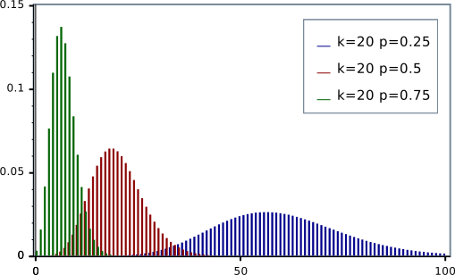
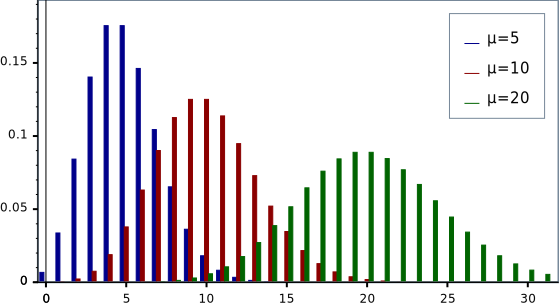

<!-- .slide: data-background-image="neville.jpg" -->

---

## c-style

```cpp
///hide
#include <cstdlib>
#include <ctime>
#include <iostream>

void foo() {
///unhide
std::srand(std::time(nullptr));

for (size_t _ = 0; _ < 1'000; ++_) {
    std::cout << std::rand() % 100'000 << '\n';
}
///hide
}
```

---

## what's wrong?

1. <!-- .element: class="fragment" -->  seed in seconds
2. <!-- .element: class="fragment" -->  non-uniform distribution
3. <!-- .element: class="fragment" -->  <code>RAND_MAX</code>
4. <!-- .element: class="fragment" -->  might not be thread safe

Note: 
1. Imagine our application runs in a grid. There's a likely chance two instances will start on the same second.
2. Assuming range is not divisible by the modulus without a remainder
3. can be as low as 32767
4. this is implementation defined

---

<!-- .slide: data-background-image="crack.gif" -->

## Pseudo-random number generation 

<!-- .element: class="chapter" -->

<div class="footnotes" style="color: #333">

Sources: 

- [N3551](http://www.open-std.org/jtc1/sc22/wg21/docs/papers/2013/n3551.pdf), Walter E. Brown
- [N1398](http://www.open-std.org/jtc1/sc22/wg21/docs/papers/2002/n1398.html), Jens Maurer

</div>

---

## why?

- numerics (simulation, Monte-Carlo integration)
- games (shuffling card decks, non-deterministic enemy behavior)
- testing (generation of test input data for good coverage)
- security (generation of cryptographic keys)

Note: Computers are deterministic machines by design: equal input data results in equal output, given the same internal state. Sometimes, applications require seemingly non-deterministic behavior, usually provided by generating random numbers.

---

<!-- .slide: class="aside" -->

## generating pseudo randomness

 

Note: We start with some seed data as an entropy source. This is used to initialize an engine which is a function object which upon call, generates a pseudo-random number and updates its internal state. The distribution post-processes the engine's output in such a way that resulting output is distributed according to a defined statistical probability density function.

---

## dice rolling

```cpp
///hide
#include <iostream>
///unhide
#include <random>

int roll_a_fair_die( ) {
  static unsigned seed{0x12345678};
  static std::default_random_engine e{seed};
  static std::uniform_int_distribution<int> d{1, 6};
  return d(e);
}
///hide

int main() {
  for (size_t i = 0; i < 20; ++i) {
      std::cout << roll_a_fair_die() << ' ';
  }
  std::cout << '\n';
}
```

---

<!-- .slide: data-background-image="engine.gif" -->

## engines

<!-- .element: class="chapter" -->

Note: An engine’s role is to return unpredictable (random) bits, ensuring that the likelihood of
next obtaining a 0 bit is always the same as the likelihood of next obtaining a 1 bit. 
To reduce overhead and improve throughput, C++ engines typically compute and return many bits per call by
encoding them into a single result of an unsigned integer type.

---

## what can it do

```cpp [1|3-5|7-16]
///hide
#include <random>
#include <iostream>
#include <cassert>
#include <sstream>

int main() {
///unhide
std::default_random_engine e;

std::cout << "e's range is [" 
          << e.min() << "," 
          << e.max() << "]\n";

std::stringstream sst;
sst << e;
const auto n1 = e();

e.seed(42);
e.discard(10);

sst >> e;
const auto n2 = e();
assert(n1 == n2);
///hide
}
```

<!-- .element: style="font-size: 0.5em" -->

Note: 
1. default constructible with some default seed
2. generates values between `min` and `max`
3. can be serialized/deserialized to an `iostream`
4. can be called directly
5. can be reseeded
6. results can be discarded

---

## Library engines

beyond `std::default_random_engine`.

Note: it is actually an alias to one of several library defined engines.

---

## Linear congruential generator (LCG)

`$$ X_{n+1} = \left( a X_n + c \right)\bmod m $$`

for some predefined `a`, `c` and `m`.

Note: of course, not every choice of parameters will generate a pseudo-random sequence. for example, a = 1 and c = 1 produces a simple modulo-m counter, but there are parameters which were found to produce series of high quality.

---

<!-- .slide: data-auto-animate -->

## LCG

```cpp
template <class UIntType, 
          UIntType a, UIntType c, UIntType m>
class linear_congruential_engine;
```

<!-- .element: data-id="code" style="font-size: 0.45em" -->

---

<!-- .slide: data-auto-animate -->

## predefined 

## LCG

```cpp
///hide
#include <cstdint>

///unhide
template <class UIntType, 
          UIntType a, UIntType c, UIntType m>
class linear_congruential_engine;

using minstd_rand0 =
    linear_congruential_engine<uint_fast32_t, 16807, 0, 2147483647>;

using minstd_rand =
    linear_congruential_engine<uint_fast32_t, 48271, 0, 2147483647>;
```

<!-- .element: data-id="code" style="font-size: 0.45em" -->

---

## Subtract with carry (SWC)

`$$ x_i = (x_{i-s} - x_{i-r} - c_{i-1})\ \bmod\ m $$`

where

`$$
c_i = \begin{cases}
    1, & \text{if } x_{i-s} - x{i-r} - c_{i-1} < 0\\
    0, & \text{otherwise}
\end{cases}
$$`

---

<!-- .slide: data-auto-animate -->

## SWC

```cpp
///hide
#include <cstddef>

///unhide
template<class UIntType,
         size_t w, size_t s, size_t r> 
class subtract_with_carry_engine;
```

<!-- .element: data-id="code" -->

---

<!-- .slide: data-auto-animate -->

## predefined 

## SWC

```cpp
///hide
#include <cstddef>
#include <cstdint>

///unhide
template<class UIntType,
         size_t w, size_t s, size_t r> 
class subtract_with_carry_engine;

using ranlux24_base 
  = subtract_with_carry_engine<uint_fast32_t, 24, 10, 24>;

using ranlux48_base 
  = subtract_with_carry_engine<uint_fast64_t, 48, 5, 12>;
```

<!-- .element: data-id="code" -->

Note: ranlux is the name of the Fortran library which was the first implementation of this RNG.

---

## mersenne twister (MT)

`$$ x_{k+n} := x_{k+m} \oplus \left( ({x_k}^u \mid\mid {x_{k+1}}^l) A \right) \qquad k=0,1,\ldots $$`

where

`$$ A = \begin{pmatrix} 0 & I_{w - 1} \\ a_{w-1} & (a_{w - 2}, \ldots , a_0) \end{pmatrix} $$`

Note: This is a form of a shift register. `||` denotes concatenation of bit vectors, `^u` means the upper `w - r` bits, and `^l` means the lower `r` bits.

---

## mersenne twister (MT)

on state `x` the engine's output will be

```cpp
///hide
#include <cstdint>

uint32_t calc(uint32_t x, uint32_t u, uint32_t s, uint32_t t, uint32_t d, uint32_t b, uint32_t c, uint32_t l) {
///unhide
auto y = x ^ ((x >> u) & d);
     y = y ^ ((y << s) & b);
     y = y ^ ((y << t) & c);
auto z = y ^ (y >> l);

return z;
///hide
}
```

for some predefined parameters `u`, `s`, `t`, `d`, `b`, `c` and `l`.

---

<!-- .slide: data-auto-animate -->

## MT

```cpp
///hide
#include <cstddef>

///unhide
template <class UIntType, size_t w, size_t n, size_t m, size_t r, UIntType a,
          size_t u, UIntType d, size_t s, UIntType b, size_t t, UIntType c,
          size_t l, UIntType f>
class mersenne_twister_engine;
```

<!-- .element: data-id="code" style="font-size: 0.4em" -->

---

<!-- .slide: data-auto-animate -->

## predefined 

## MT

```cpp
///hide
#include <cstddef>
#include <cstdint>

///unhide
template <class UIntType, size_t w, size_t n, size_t m, size_t r, UIntType a,
          size_t u, UIntType d, size_t s, UIntType b, size_t t, UIntType c,
          size_t l, UIntType f>
class mersenne_twister_engine;

using mt19937 =
    mersenne_twister_engine<uint_fast32_t, 32, 624, 397, 31, 0x9908b0df,
                            11, 0xffffffff, 7, 0x9d2c5680, 15, 0xefc60000, 18,
                            1812433253>;

using mt19937_64 =
    mersenne_twister_engine<uint_fast64_t, 64, 312, 156, 31,
                            0xb5026f5aa96619e9, 29, 0x5555555555555555, 17,
                            0x71d67fffeda60000, 37, 0xfff7eee000000000, 43,
                            6364136223846793005>;
```

<!-- .element: data-id="code" style="font-size: 0.4em" -->

Note: the period of those engines is `2^19937 − 1`

---

## engine adaptors

generate pseudo-random numbers using another random number engine as entropy source.

---

<!-- .slide: data-auto-animate -->

## `discard_block_engine`

```cpp
///hide
#include <cstddef>

///unhide
template <class Engine,
          size_t P, size_t R> 
class discard_block_engine;
```

<!-- .element: data-id="code" -->

FILE: 12_random/discard.svg

Note: From each block of size P generated by the base engine, the adaptor keeps only R numbers, discarding the rest.

---

<!-- .slide: data-auto-animate -->

## predefined

## `discard_block_engine`

```cpp
///hide
#include <cstddef>
#include <cstdint>

template<class UIntType,
         size_t w, size_t s, size_t r> 
class subtract_with_carry_engine;

using ranlux24_base 
  = subtract_with_carry_engine<uint_fast32_t, 24, 10, 24>;

using ranlux48_base 
  = subtract_with_carry_engine<uint_fast64_t, 48, 5, 12>;

///unhide
template <class Engine,
          size_t P, size_t R> 
class discard_block_engine;

using ranlux24 
  = discard_block_engine<ranlux24_base, 223, 23>;

using ranlux48 
  = discard_block_engine<ranlux48_base, 389, 11>;
```

<!-- .element: data-id="code" -->

---

<!-- .slide: data-auto-animate data-autoslide="2000" -->

## `shuffle_order_engine`

```cpp
///hide
#include <cstddef>

///unhide
template<class Engine,
         std::size_t K> 
class shuffle_order_engine;
```

<!-- .element: data-id="code" -->

FILE: 12_random/shuffle_pre.svg

Note: It maintains a table of size K and delivers a randomly selected number from that table when requested, replacing it with a number generated by the base engine

---

<!-- .slide: data-auto-animate -->

## `shuffle_order_engine`

```cpp
///hide
#include <cstddef>

///unhide
template<class Engine,
         std::size_t K> 
class shuffle_order_engine;
```

<!-- .element: data-id="code" -->

FILE: 12_random/shuffle_post.svg

---

<!-- .slide: data-auto-animate -->

## predefined

## `shuffle_order_engine`

```cpp
///hide
#include <cstdint>
#include <cstddef>

template <class UIntType, 
          UIntType a, UIntType c, UIntType m>
class linear_congruential_engine;

using minstd_rand0 =
    linear_congruential_engine<uint_fast32_t, 16807, 0, 2147483647>;

///unhide
template<class Engine,
         std::size_t K> 
class shuffle_order_engine;

using knuth_b =
  shuffle_order_engine<minstd_rand0, 256>;
```

<!-- .element: data-id="code" -->

---

## `independent_bits_engine`

```cpp
///hide
#include <cstddef>

///unhide
template<class Engine,
         std::size_t W,
         class UIntType> 
class independent_bits_engine;
```

Note: produces random numbers with different number of bits than that of the wrapped engine

---

## what to choose

| engine | quality | speed | state size |
|--------|---------|-------|------------|
|`linear_congruential_engine`|medium|medium|1 word|
|`mersenne_twister_engine`|good|fast|624 words|
|`subtract_with_carry_engine`|medium|fast|25 words|
|`discard_block_engine`|good|slow|base + 1 word|
|`shuffle_order_engine`|good|fast|base + 100 words|

<!-- .element: style="font-size: 0.7em" -->

Note:
- quality: What is the cycle length? Does the engine pass all relevant statistical tests?
- speed: How many and what kind of operations have to be performed to produce one random number, on average?

---

<!-- .slide: data-background-image="distribution.gif" -->

## distributions

<!-- .element: class="chapter" -->

Note: It makes no sense to ask for a random number without some context. 
A distribution’s role is to return random numbers (variates) whose likelihoods correspond to
a specific shape. E.g., a normal distribution produces variates according to a "bell-shaped
curve."

---

## what can it do

```cpp [1-2,17|3|5-7|9-16]
///hide
#include <random>
#include <iostream>
#include <cassert>
#include <sstream>

///unhide
template<typename Distribution, typename Engine>
void distribute(Engine& e) {
  Distribution d;

  std::cout << "d's range is [" 
            << d.min() << "," 
            << d.max() << "]\n";

  std::stringstream sst;
  sst << e << '\n' << d << '\n';
  const auto n1 = d(e);
  d(e);

  sst >> e >> d;
  const auto n2 = d(e);
  assert(n1 == n2);
}
///hide

int main() {
  std::default_random_engine e;
  distribute<std::uniform_int_distribution<>>(e);
}
```

<!-- .element: style="font-size: 0.45em" -->

Note: 
1. default constructible
2. generates values between `min` and `max`
3. can be serialized/deserialized to an `iostream`
4. can be called directly
5. can be reseeded
6. results can be discarded

---

## distribution parameters

```cpp [1-2,13|3|5-6|6,8-9|6,11-12]
///hide
#include <cassert>
#include <random>

///unhide
template<typename Distribution, typename Engine, typename... Params>
void distribute(Engine& e, Params... params) {
  Distribution d1{params...};

  typename Distribution::param_type p{params...};
  Distribution d2{p};

  d1.param(p);
  assert(d1.param() == d2.param());

  Distribution d3;
  assert(d3(e, p) == d2(e));
}

///hide

int main() {
  std::default_random_engine e;
  distribute<std::uniform_int_distribution<>>(e, 1, 6);
}
```

<!-- .element: style="font-size: 0.45em" -->

---

## Library distributions

no default this time

---

## uniform distributions


<!-- .element: class="r-stretch" -->

Note: Gerolamo Cardano, one of the fathers of the probability theory.

---

### integral uniform distribution

```cpp
template<class IntType = int>
class uniform_int_distribution;
```

<div class="distribution">

<formula>

`$$ P(i|a,b) = \frac{1}{b-a+1} $$`

 </formula>

 <parameters>

|parameter|type|default|
|---------|----|-------|
|`a`|`IntType`|`0`|
|`b`|`IntType`|`numeric_limits<IntType>::max()`|

<!-- .element: style="font-size: 0.3em" -->

</parameters>

<diagram>


</diagram>

</div>

Note: Produces random integer values `i`, uniformly distributed on the closed interval `[a, b]`

---

### floating point uniform distribution

```cpp
template<class RealType = double>
class uniform_real_distribution;
```

<div class="distribution">

<formula>

`$$ P(i|a,b) = \frac{1}{b-a} $$`

 </formula>

 <parameters>

|parameter|type|default|
|---------|----|-------|
|`a`|`RealType`|`0.0`|
|`b`|`RealType`|`1.0`|

</parameters>

<diagram>


</diagram>

</div>

Note: Produces random floating-point values `i`, uniformly distributed on the closed interval `[a, b]`

---

## Bernoulli distributions


<!-- .element: class="r-stretch" -->

Note: named after Swiss mathematician Jacob Bernoulli.

---

### Bernoulli distribution

```cpp
class bernoulli_distribution;
```

<div class="distribution">

<formula>

`$$ P(b|p) = \begin{cases}
   p & \text{if }b == true, \\
   1-p & \text {if } b == false.
 \end{cases} $$`

 </formula>

 <parameters>

|parameter|type|default|
|---------|----|-------|
|`p`|`double`|`0.5`|

</parameters>

<diagram>


</diagram>

</div>

Note: Produces random boolean values, according to the discrete probability function. It can be thought of as a model for the set of possible outcomes of any single experiment that asks a yes–no question (coin toss).

---

### Binomial distribution

```cpp
template<class IntType = int>
class binomial_distribution;
```

<div class="distribution">

<formula>

`$$ P(i|t,p) = \binom{t}{i}p^i(1-p)^{t-i} $$`

 </formula>

 <parameters>

|parameter|type|default|
|---------|----|-------|
|`t`|`IntType`|`1`|
|`p`|`double`|`0.5`|

</parameters>

<diagram>


</diagram>

</div>

Note: The value obtained is the number of successes in a sequence of `t` yes/no experiments, each of which succeeds with probability `p`. Notice that Bernoulli distribution is a special case of the binomial distribution, where `t = 1`.

---

### Negative Binomial distribution

```cpp
template<class IntType = int>
class negative_binomial_distribution;
```

<div class="distribution">

<formula>

`$$ P(i|k,p) = \binom{k+i-1}{i}p^k(1-p)^i $$`

 </formula>

 <parameters>

|parameter|type|default|
|---------|----|-------|
|`k`|`IntType`|`1`|
|`p`|`double`|`0.5`|

</parameters>

<diagram>



</diagram>

</div>

Note: The value represents the number of failures in a series of independent yes/no trials (each succeeds with probability `p`), before exactly `k` successes occur.

---

### Geometric distribution

```cpp
template<class IntType = int>
class geometric_distribution;
```

<div class="distribution">

<formula>

`$$ P(i|p) = p\cdot(1-p)^i $$`

 </formula>

 <parameters>

|parameter|type|default|
|---------|----|-------|
|`p`|`double`|`0.5`|

</parameters>

<diagram>


</diagram>

</div>

Note: The value represents the number of yes/no trials (each succeeding with probability `p`) which are necessary to obtain a single success. It is exactly equivalent to `std::negative_binomial_distribution<>(1, p)`;

---

## Poisson distributions


<!-- .element: class="r-stretch" -->

Note: named after French mathematician Siméon Denis Poisson

---

### Poisson distribution

```cpp
template<class IntType = int>
class poisson_distribution;
```

<div class="distribution">

<formula>

`$$ P(i|\mu) = \frac{e^{-\mu} \mu^i}{i!} $$`

 </formula>

 <parameters>

|parameter|type|default|
|---------|----|-------|
|`mean`|`double`|`1.0`|

</parameters>

<diagram>



</diagram>

</div>

Note: The value obtained is the probability of exactly `i` occurrences of a random event if the expected, mean number of its occurrence under the same conditions (on the same time/space interval) is `μ`.

The Poisson distribution may be useful to model events such as
- The number of meteorites greater than 1 meter diameter that strike Earth in a year
- The number of patients arriving in an emergency room between 10 and 11 pm
- The number of laser photons hitting a detector in a particular time interval

---

### Exponential distribution

```cpp
template<class RealType = double>
class exponential_distribution;
```

<div class="distribution">

<formula>

`$$ P(x|\lambda) = \lambda e^{-\lambda x} $$`

 </formula>

 <parameters>

|parameter|type|default|
|---------|----|-------|
|`lambda`|`RealType`|`1.0`|

</parameters>

<diagram>


</diagram>

</div>

Note: The value obtained is the time/distance until the next random event if random events occur at constant rate λ per unit of time/distance. For example, the time it takes before the next telephone call in a call center.

---

### Gamma distribution

```cpp
template<class RealType = double>
class gamma_distribution;
```

<div class="distribution">

<formula>

`$$ P(x|\alpha,\beta) = \frac{e^{-x/\beta}}{\beta^a\cdot\Gamma(\alpha)}\cdot x^{\alpha-1} $$`

 </formula>

 <parameters>

|parameter|type|default|
|---------|----|-------|
|`alpha`|`RealType`|`1.0`|
|`beta`|`RealType`|`1.0`|

</parameters>

<diagram>


</diagram>

</div>

Note: The value obtained is the sum of `α` independent exponentially distributed random variables, each of which has a mean of `β`. This is a generalization of the exponential distribution. The gamma distribution is used to model the fading of signal power in wireless communication.

---

### Weibull distribution

```cpp
template<class RealType = double>
class weibull_distribution;
```

<div class="distribution">

<formula>

`$$ P(x|a,b) = \frac{a}{b}(\frac{x}{b})^{a-1}e^{-(x/b)^a} $$`

 </formula>

 <parameters>

|parameter|type|default|
|---------|----|-------|
|`a`|`RealType`|`1.0`|
|`b`|`RealType`|`1.0`|

</parameters>

<diagram>


</diagram>

</div>

Note: The Weibull distribution is often used in the field of failure analysis; in particular it can mimic distributions where the failure rate varies over time. 

---

### Extreme value distribution

```cpp
template<class RealType = double>
class extreme_value_distribution;
```

<div class="distribution">

<formula>

`$$ P(x|a,b) = \frac{1}{b}e^{\frac{a-x}{b}-e^{(a-x)/b}} $$`

 </formula>

 <parameters>

|parameter|type|default|
|---------|----|-------|
|`a`|`RealType`|`0.0`|
|`b`|`RealType`|`1.0`|

</parameters>

<diagram>


</diagram>

</div>

Note: AKA Gumbel distribution. Used to model the distribution of the maximum (or the minimum) of a number of samples of various distributions. For example, the distribution of the maximum level of a river in a particular year if there was a list of maximum values for the past ten years.

---

## normal distributions


<!-- .element: class="r-stretch" -->

Note: AKA Gaussian distributions after the German mathematician Johann Carl Friedrich Gauss.

---

### Normal distribution

```cpp
template<class RealType = double>
class normal_distribution;
```

<div class="distribution">

<formula>

`$$ P(x|\mu,\sigma) = \frac{1}{\sigma\sqrt{2\pi}}e^{-\frac{1}{2}(\frac{x-\mu}{\sigma})^2} $$`

 </formula>

 <parameters>

|parameter|type|default|
|---------|----|-------|
|`mean`|`RealType`|`0.0`|
|`stddev`|`RealType`|`1.0`|

</parameters>

<diagram>


</diagram>

</div>

Note: probably the most well known statistical distribution. For example, total distance covered in a random walk.

---

### Log-normal distribution

```cpp
template<class RealType = double>
class lognormal_distribution;
```

<div class="distribution">

<formula>

`$$ P(x|m,s) = \frac{1}{sx\sqrt{2\pi}}e^{-\frac{(\ln{x}-m)^2}{2s^2}} $$`

 </formula>

 <parameters>

|parameter|type|default|
|---------|----|-------|
|`m`|`RealType`|`0.0`|
|`s`|`RealType`|`1.0`|

</parameters>

<diagram>


</diagram>

</div>

Note: important in the description of natural phenomena. e.g. The length of comments posted in internet discussion forums.

---

### Chi-square distribution

```cpp
template<class RealType = double>
class chi_squared_distribution;
```

<div class="distribution">

<formula>

`$$ P(x|n) = \frac{x^{(n/2)-1}e^{-x/2}}{\Gamma(n/2)2^{n/2}} $$`

 </formula>

 <parameters>

|parameter|type|default|
|---------|----|-------|
|`n`|`RealType`|`1.0`|

</parameters>

<diagram>


</diagram>

</div>

Note: Value is the sum of the squares of `n` independent standard normal random variables. It is one of the most widely used distributions in statistical tests, and is often encountered in magnetic resonance imaging (MRI).

---

### Cauchy distribution

```cpp
template<class RealType = double>
class cauchy_distribution;
```

<div class="distribution">

<formula>

`$$ P(x|a,b) = (b\pi[1+\frac{x-a}{b}^2])^{-1} $$`

 </formula>

 <parameters>

|parameter|type|default|
|---------|----|-------|
|`a`|`RealType`|`0.0`|
|`b`|`RealType`|`1.0`|

</parameters>

<diagram>


</diagram>

</div>

Note: It the distribution of the ratio of two independent normally distributed random variables with mean zero. 

---

### F-distribution

```cpp
template<class RealType = double>
class fisher_f_distribution;
```

<div class="distribution">

<formula style="font-size: 0.6em">

`$$ P(x|m,n) = \frac{\Gamma\big((m+n)/2\big)
     \cdot \left(\frac{m}{n}\right)^{m/2}
     \cdot x^{(m/2)-1}}{\Gamma(m/2) \; \Gamma(n/2) \left(1 + \frac{m x}{n}\right)^{(m + n)/2}} $$`

 </formula>

 <parameters>

|parameter|type|default|
|---------|----|-------|
|`m`|`RealType`|`1.0`|
|`n`|`RealType`|`1.0`|

</parameters>

<diagram>


</diagram>

</div>

Note: It is most often used when comparing statistical models that have been fitted to a data set, in order to identify the model that best fits the population from which the data were sampled. 

---

### Student's t-distribution

```cpp
template<class RealType = double>
class student_t_distribution;
```

<div class="distribution">

<formula>

`$$ P(x|n) = \frac{\Gamma\big((n+1)/2\big)}{\Gamma(n/2)\sqrt{n \pi}\left(1 + \frac{x^2}{n} \right)^{(n+1)/2}} $$`

 </formula>

 <parameters>

|parameter|type|default|
|---------|----|-------|
|`n`|`RealType`|`1.0`|

</parameters>

<diagram>


</diagram>

</div>

Note: It is used when estimating the mean of a normally distributed population in situations where the sample size is small and the population standard deviation is unknown. 

---

## Sampling distributions


Note: Sampling distributions are useful when you need to define a distribution based on a set of sample values, typically samples from the real world. The meaning of entropy in the context of data was developed by an American mathematician named Claude Shannon.

---

### Discrete distribution

```cpp
template<class IntType = int>
class discrete_distribution;
```

<div class="distribution">

<formula>

`$$ P(i \,|\, p_0, \dotsc, p_{n-1}) = p_i $$`

 </formula>

 <parameters>

|parameter|type|default|
|---------|----|-------|
|`probabilities`|`std::vector<double>`|`{1.0}`|

<!-- .element:  style="font-size: 0.4em" -->

</parameters>

<diagram>


</diagram>

</div>

Note: A generalization of `uniform_int_distribution`

---

### Piecewise constant distribution

```cpp
template<class RealType = double>
class piecewise_constant_distribution;
```

<div class="distribution">

<formula>

`$$ p(x \,|\, b_0, \dotsc, b_n, \; \rho_0, \dotsc, \rho_{n-1}) = \rho_i $$`
`$$ \text{for $b_i \le x < b_{i+1}$} $$`

 </formula>

 <parameters>

|parameter|type|default|
|---------|----|-------|
|`intervals`|`std::vector<RealType>`|`{0, 1}`|
|`densities`|`std::vector<RealType>`|`{1}`|

<!-- .element:  style="font-size: 0.4em" -->

</parameters>

<diagram>


</diagram>

</div>

Note: A generalization of `uniform_real_distribution`

---

### Piecewise linear distribution

```cpp
template<class RealType = double>
class piecewise_linear_distribution;
```

<div class="distribution">

<formula>

`$$ p(x \,|\, b_0, \dotsc, b_n, \; \rho_0, \dotsc, \rho_n) = $$` 
`$$ \rho_{i} \cdot {\frac{b_{i+1} - x}{b_{i+1} - b_i}} + \rho_{i+1} \cdot {\frac{x - b_i}{b_{i+1} - b_i}} $$`
`$$ \text{for $b_i \le x < b_{i+1}$} $$`

 </formula>

 <parameters>

|parameter|type|default|
|---------|----|-------|
|`intervals`|`std::vector<RealType>`|`{0, 1}`|
|`densities`|`std::vector<RealType>`|`{1}`|

<!-- .element:  style="font-size: 0.4em" -->

</parameters>

<diagram>


</diagram>

</div>

Note: A generalization of `piecewise_constant_distribution`

---

## example

```cpp
///external
///compiler=g102
///options+=-std=c++2a
///hide
#include <algorithm>
#include <cmath>
#include <iomanip>
#include <iostream>
#include <map>
#include <random>
#include <vector>

template <int Height = 8, int BarWidth = 5, int Padding = 1, int Offset = 0,
          bool DrawMinMax = true, class Hist>
void draw_vbars(const char* name, Hist const& hist, const int norm) {
    const float cutoff = 0.002f;
    static_assert((Height > 0) && (BarWidth > 0) && (Padding >= 0) && (Offset >= 0));
    auto cout_n = [](auto const& v, int n) { while (n-- > 0) std::cout << v; };

    std::vector<float> bars;
    std::vector<int> indices;
    for (const auto [n, p] : hist) {
        if (float x = p * (1.0/norm); cutoff < x) {
            bars.push_back(x);
            indices.push_back(n);
        }
    }

    const auto [min, max] = std::minmax_element(std::cbegin(bars), std::cend(bars));
    std::vector<std::div_t> qr;
    for (float e : bars) {
        qr.push_back(std::div(std::lerp(0.f, Height*8, (e - *min)/(*max - *min)), 8));
    }

    std::cout << name << ":\n";
    for (auto h{Height}; h-- > 0 ;) {
        cout_n(' ', Offset);
        for (auto [q, r] : qr) {
            char d[] = "█"; // == { 0xe2, 0x96, 0x88, 0 }
            q < h ? d[0] = ' ', d[1] = '\0' : q == h ? d[2] -= (7 - r) : 0;
            cout_n(d, BarWidth);
            cout_n(' ', Padding);
        }
        if (DrawMinMax && Height > 1)
            h == Height - 1 ? std::cout << "┬ " << *max:
                     h != 0 ? std::cout << "│"
                            : std::cout << "┴ " << *min;
        cout_n('\n', 1);
    }
    for (int n : indices) { std::cout << " " << std::setw(2) << n << "   "; }
        cout_n('\n', 2);
}

///unhide
template<typename Engine, typename Distribution>
void generate_and_draw(Engine& gen, Distribution&& d, const char* name) {
    const int norm = 1'00'00;
    std::map<int, int> hist{};
    for (int n=0; n!=norm; ++n) { ++hist[std::round(d(gen))]; }
    draw_vbars(name, hist, norm);
}

///hide
int main() {
///unhide
std::mt19937 gen;
generate_and_draw(gen, std::normal_distribution<>{5,2}, "Normal");
generate_and_draw(gen, std::uniform_real_distribution<>{1.0, 7.0}, "Uniform");
generate_and_draw(gen, std::binomial_distribution<>{4, 0.5}, "Binomial");
generate_and_draw(gen, std::fisher_f_distribution<float>{1.0f, 5.0f}, "Fisher F");
///hide
}
```

<!-- .element: style="font-size: 0.4em" -->

---

## standard uniform distribution

```cpp
///hide
#include <random>
#include <iostream>
#include <algorithm>
#include <iterator>
#include <iomanip>

int main() {
///unhide
std::default_random_engine rng;

std::generate_n(std::ostream_iterator<double>{std::cout << std::fixed 
                                                        << std::setprecision(4), 
                                              " "}, 
                8,
                [&rng] { return std::generate_canonical<double, 12>(rng); });

std::cout << '\n';
///hide
}
```

<!-- .element: style="font-size: 0.4em" -->

Note: The `generate_canonical` function template provides a standard uniform distribution of floating-point values over the range `[0,1)` with a given number of random bits.

---

<!-- .slide: data-background-image="sid.gif" -->

## Seeds

<!-- .element: class="chapter" -->

Note: An algorithm for random number generation always starts with one or more seeds, which represent the initial input to the calculation that produces the random numbers. The seeds determine the initial state of a random number generator and determine the entire sequence. The number of bits in a seed is significant. With a 1-byte seed, you only have 255 possible values, so you can only produce a maximum of 255 different sequences. To maximize the entropy of a random sequence, you need two things: you need a seed value that is truly random – not pseudo-random, and you need the range of possible values for the seed to be large.

---

<!-- .slide: data-auto-animate -->

## `std::random_device`

```cpp
///hide
#include <random>
#include <iostream>

int main() {
///unhide
std::random_device rd;

std::cout << "rd's range is [" 
          << rd.min() << "," 
          << rd.max() << "]\n";

std::cout << "rd's entropy is " << rd.entropy() << '\n';

std::cout << "generated " << rd() << '\n';
///hide
}
```

<!-- .element: data-id="code" -->

Note: Using the OS to gen nondeterministic number from sources such as the times between successive keyboard keystrokes, or intervals between mouse clicks, or the current clock time.

---

<!-- .slide: data-auto-animate -->

## specifying source 

```cpp
///hide
///external
#include <random>
#include <iostream>

int main() {
///unhide
std::random_device rd{"/dev/random"};

std::cout << "rd's range is [" 
          << rd.min() << "," 
          << rd.max() << "]\n";

std::cout << "rd's entropy is " << rd.entropy() << '\n';

std::cout << "generated " << rd() << '\n';
///hide
}
```

<!-- .element: data-id="code" -->

Note: Differs between implementations. Some of `libstdc++` sources are `rdseed` and `dev/urandom`. Might fall back to a pseudo RNG if no source is available.

---

## seeding a pseudo RNG

```cpp
///hide
///external
#include <random>
#include <iostream>

int main() {
///unhide
std::random_device rd;
std::mt19937 gen{rd()};

std::cout << "generated " << gen() << '\n';
///hide
}
```

Note: As we saw, `mt19937`'s state is 624 words, so seeding it with a 32-bit value limits the possible entropy.

---

## `std::seed_seq`

```cpp [1|3-4]
///hide
#include <random>
#include <vector>
#include <iostream>

int main()
{
///unhide
std::seed_seq seq{1,2,3,4,5};

std::vector<std::uint32_t> seeds(10);
seq.generate(seeds.begin(), seeds.end());

for (std::uint32_t n : seeds) {
  std::cout << n << '\n';
}
///hide
}
```

Note: It consumes a sequence of integer-valued data and produces a requested number of unsigned integer values, based on the consumed data. The produced values are distributed over the entire 32-bit range even if the consumed values are close.
It provides a way to seed a large number of random number engines or to seed a generator that requires a lot of entropy, given a small seed or a poorly distributed initial seed sequence.

---

## initializing RNG

```cpp
///hide
#include <random>
#include <vector>
#include <iostream>

int main()
{
///unhide
std::random_device rd;
std::seed_seq seq{rd(), rd()};
std::mt19937_64{seq};
///hide
}
```

Note: the RNG calls `generate` to initialize its internal state

---

## querying params

```cpp [1-3|5-7]
///hide
#include <random>
#include <iostream>
#include <iterator>
#include <sstream>

int main()
{
///unhide
std::stringstream sst{"-1 0 1"};
std::seed_seq s1(std::istream_iterator<uint32_t>{sst}, 
                 std::istream_iterator<uint32_t>{});

std::cout << "size: " << s1.size() << '\n';
s1.param(std::ostream_iterator<int>(std::cout, " "));
std::cout << '\n';
///hide
}
```

---

## `std::shuffle`

```cpp [4-6]
///hide
#include <random>
#include <algorithm>
#include <iterator>
#include <iostream>
 
int main()
{
///unhide
std::vector<int> v = {1, 2, 3, 4, 5, 6, 7, 8, 9, 10};

std::random_device rd;
std::mt19937 g(rd());

std::shuffle(v.begin(), v.end(), g);

std::copy(v.begin(), v.end(), 
          std::ostream_iterator<int>(std::cout, " "));
std::cout << "\n";
///hide
}
```

Note: a new algorithm for shuffling random access ranges. deprecates `std::random_shuffle` which used `std::rand`.

---

## possible implementation

```cpp [8-13]
///hide
#include <iterator>
#include <random>

///unhide
template<class RandomIt, class URBG>
void shuffle(RandomIt first, RandomIt last, URBG&& g)
{
  typedef typename std::iterator_traits<RandomIt>::difference_type diff_t;
  typedef std::uniform_int_distribution<diff_t> distr_t;
  typedef typename distr_t::param_type param_t;

  distr_t D;
  diff_t n = last - first;
  for (diff_t i = n-1; i > 0; --i) {
    using std::swap;
    swap(first[i], first[D(g, param_t(0, i))]);
  }
}
```

<!-- .element: style="font-size: 0.4em" -->

Note: the actual implementation is not standardized so different platform might order the range differently.

---

<!-- .slide: data-background-image="thanks.gif" -->

## thank you

<!-- .element: class="chapter" -->