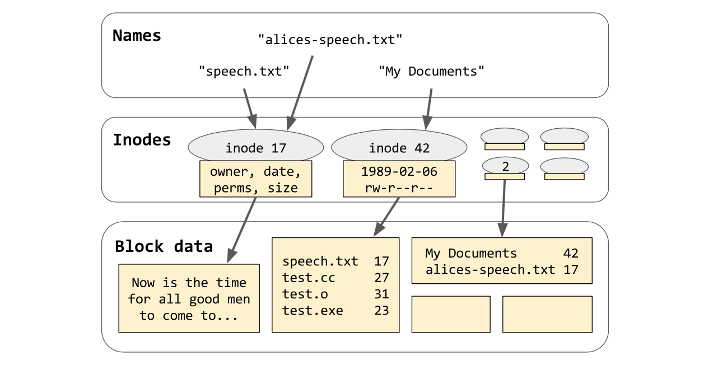

<!-- .slide: data-background-image="vidic.jpg" -->

---

<!-- .slide: data-background-image="multipass.gif" -->

# `std::filesystem`

<!-- .element: class="chapter" -->

<div class="footnotes">

Sources: 

 - [P0218](https://wg21.link/p0218), Beman Dawes
 - [Boost.Filesystem](https://www.boost.org/doc/libs/1_75_0/libs/filesystem/doc/tutorial.html), Beman Dawes
 - [Mastering the C++17 STL](https://www.packtpub.com/product/mastering-the-c-17-stl/9781787126824), Arthur O'Dwyer

</div>

---

## a little refresher



<!-- .element: class="r-stretch" -->

`/My Documents/speech.txt` → "Now is the time..."

<!-- .element: class="fragment" style="font-size: 0.7em" -->

`/alice-speech.txt` → "Now is the time..."

<!-- .element: class="fragment" style="font-size: 0.7em" -->

Note: the top level consists of abstract names which are mapped to concrete structures, called inodes in POSIX. each inode contains a set of attributes like size, owner, modification date, etc. and a pointer to the actual contents. The exact representation depends on the kind of file system, e.g. FAT32, ext4 or NTFS.

some blocks contain just mapping of names to inode numbers - these are directories. each file system has one special inode called the root directory. each file can be unambiguously identified by a path of names that leads from the root directory down to that file. for example, suppose that inode 2 is the root directory, then the path "/My Documents/speech.txt" points to the file containing "Now is the time...". We use slashes to compose these individual names into a single path, and we put a single slash on the front to indicate that we're starting from the root directory. When we access a file, the OS takes the path, splits it up at the slashes and descends into the directory structure of the file system until it finally reaches the inode of the requested file.

Alternatively, "/alice-speech.txt" is also a path leading from the root to inode 17. The two paths are 'hard links' to the same inode. This works like a ref-counted smart pointer, that is, a file is deleted only once all the hard links to it are deleted. For this reason, there's no point asking what is the name of a file as it can have multiple names.

---

<!-- .slide: class="aside" -->

## explicit typing

```cpp
///hide
#include <utility>
///unhide
std::pair<int, double> p{2, 4.5};
```

---

<!-- .slide: class="aside" -->

## not always possible to type

```cpp [1-12|16-21]
///hide
#include <algorithm>
#include <iostream>
#include <vector>
#include <functional>

using LAMBDA = std::function<void(int)>;

///unhide
template<typename Func>
struct Logger {
  Logger(Func f) : f_{f} {}

  template<typename T>
  auto operator()(T&& t) {
    std::cout << "calling with " << t << '\n';
    return f(std::forward<T>(t));
  }

  Func f_;
};

template<typename T>
void logged_print(const std::vector<T>& v) {
  std::for_each(v.begin(), v.end(), 
                Logger<LAMBDA>{[](const T& t) {
                    std::cout << t << ' ';
                  }
                }
  );
}


```

<!-- .element: class="split" -->

---

<!-- .slide: class="aside" -->

## make functions

```cpp
///hide 
#include <utility>
///unhide
auto p = std::make_pair(2, 4.5);
```

Note:

- Creating "make functions" like make_tuple is confusing, artificial, extra boilerplate, and inconsistent with how non-template classes are constructed.
- Since the standard library doesn't follow any consistent convention for make functions, users have to scurry through documentation to find they need to use `make_tuple` for tuples and `back_inserter` for `back_insert_iterator`s. Of course their own template classes might not be as consistent or thoroughly-documented as the standard.
- A make function may do more than just deduce constructor template arguments. 

---

<!-- .slide: id="ctad" data-background-image="favorite.gif" -->

Source: [P0091](https://wg21.link/p0091), Mike Spertus, Faisal Vali, Richard Smith

<!-- .element: class="footnote" -->

## Class Template Argument Deduction

<!-- .element: class="chapter" -->

---

<!-- .slide: class="aside" -->

## CTAD

```cpp
///options+=-std=c++17
///hide
#include <utility>

#include <algorithm>
#include <iostream>
#include <vector>
#include <functional>

using LAMBDA = std::function<void(int)>;

template<typename Func>
struct Logger {
  Logger(Func f) : f_{f} {}

  template<typename T>
  auto operator()(T&& t) {
    std::cout << "calling with " << t << '\n';
    return f(std::forward<T>(t));
  }

  Func f_;
};
///unhide
std::pair p{2, 4.5};
static_assert(std::is_same_v<decltype(p), std::pair<int, double>>);

template<typename T>
void logged_print(const std::vector<T>& v) {
  std::for_each(v.begin(), v.end(), 
                Logger{[](const T& t) { std::cout << t << ' '; }});
}
```

<!-- .element: style="font-size: 0.5em" -->

---

<!-- .slide: class="aside" -->

## how does it work

```cpp
///options+=-std=c++17
template<typename T> struct UniquePtr {
  UniquePtr(T* t);
};

UniquePtr dp{new auto(2.0)};
```

<!-- .element: style="font-size: 0.5em" -->

compiler creates set of **deduction guides**:

<!-- .element: class="fragment" data-fragment-index="0" -->

<div class="r-stack no-margin">

<div class="fragment" data-fragment-index="0">

```cpp []
///options+=-std=c++17
///hide
template<typename T> struct UniquePtr {
  UniquePtr(T* t);
};

///unhide
template<typename T> 
UniquePtr(UniquePtr<T> const&) -> UniquePtr<T>; // implicit copy ctor.
template<typename T> 
UniquePtr(UniquePtr<T> &&) -> UniquePtr<T>;     // implicit move ctor.
template<typename T> 
UniquePtr(T *p) -> UniquePtr<T>;                // user defined ctor.
```

<!-- .element: class="no-line-numbers" style="font-size: 0.45em" -->

</div>

<div class="fragment" data-fragment-index="1">

```cpp [5-6]
///options+=-std=c++17
///hide
template<typename T> struct UniquePtr {
  UniquePtr(T* t);
};

///unhide
template<typename T> 
UniquePtr(UniquePtr<T> const&) -> UniquePtr<T>; // implicit copy ctor.
template<typename T> 
UniquePtr(UniquePtr<T> &&) -> UniquePtr<T>;     // implicit move ctor.
template<typename T> 
UniquePtr(T *p) -> UniquePtr<T>;                // user defined ctor.
```

<!-- .element: class="no-line-numbers" style="font-size: 0.45em" -->

</div>

</div>

<div class="fragment" data-fragment-index="1">

and performs overload resolution

```cpp
///options+=-std=c++17
///hide
#include <type_traits>
template<typename T> struct UniquePtr {
  UniquePtr(T* t);
};

UniquePtr dp{new auto(2.0)};
///unhide
static_assert(std::is_same_v<decltype(dp), UniquePtr<double>>);
```

<!-- .element: style="font-size: 0.5em" -->

</div>

---

<!-- .slide: class="aside" -->

## another example

```cpp
///options+=-std=c++17
template<typename T> struct S {
  template<typename U> struct N {
    N(T);
    N(T, U);
    template<typename V> N(V, U);
  };
};

S<int>::N x{2.0, 1};
```

<!-- .element: style="font-size: 0.4em" -->

<div class="r-stack no-margin">

<div class="fragment" data-fragment-index="0">

```cpp []
///options+=-std=c++17
///fails=error: invalid declarator before 'const'
///hide
template<typename T> struct S {
  template<typename U> struct N {
    N(T);
    N(T, U);
    template<typename V> N(V, U);
  };
};
///unhide
template<typename U> 
S<int>::N(S<int>::N<U> const&) -> S<int>::N<U>;
template<typename U> 
S<int>::N(S<int>::N<U> &&) -> S<int>::N<U>;
template<typename U> 
S<int>::N(int) -> S<int>::N<U>;
template<typename U>
S<int>::N(int, U) -> S<int>::N<U>;
template<typename U, typename V> 
S<int>::N(V, U) -> S<int>::N<U>;
```

<!-- .element: class="no-line-numbers" style="font-size: 0.4em" -->

</div>

<div class="fragment" data-fragment-index="1">

```cpp [9-10]
///options+=-std=c++17
///fails=error: invalid declarator before 'const'
///hide
template<typename T> struct S {
  template<typename U> struct N {
    N(T);
    N(T, U);
    template<typename V> N(V, U);
  };
};
///unhide
template<typename U> 
S<int>::N(S<int>::N<U> const&) -> S<int>::N<U>;
template<typename U> 
S<int>::N(S<int>::N<U> &&) -> S<int>::N<U>;
template<typename U> 
S<int>::N(int) -> S<int>::N<U>;
template<typename U>
S<int>::N(int, U) -> S<int>::N<U>;
template<typename U, typename V> 
S<int>::N(V, U) -> S<int>::N<U>;
```

<!-- .element: class="no-line-numbers" style="font-size: 0.4em" -->

</div>

</div>

<div class="fragment" data-fragment-index="1">

```cpp
///options+=-std=c++17
///hide
#include <type_traits>

template<typename T> struct S {
  template<typename U> struct N {
    N(T);
    N(T, U);
    template<typename V> N(V, U);
  };
};

S<int>::N x{2.0, 1};
///unhide
static_assert(std::is_same_v<decltype(x), S<int>::N<int>>);
```

<!-- .element: style="font-size: 0.4em" -->

</div>

Note: Template arguments can only be left out this way from the "type" of the declaration, but not from any name qualifiers used in naming the template; i.e., we couldn't replace `S<int>::N` by just `S::N` using some sort of additional level of deduction. 

---

<!-- .slide: class="aside" -->

## hard to deduce

```cpp
///options+=-std=c++17
///fails=class template argument deduction failed
///hide
#include <cstddef>

///unhide
template<typename T>
class vector {
  struct iterator {
    using value_type = T;
    /* ... */
  };

  using value_type = typename iterator::value_type;

  vector(size_t count, const value_type& t = {});

  template<typename InputIt>
  vector(InputIt from, InputIt to);
};

vector v1{5, 'c'};
vector v2{v1.begin(), v1.end()};
```

<!-- .element: style="font-size: 0.45em" -->

---

<!-- .slide: class="aside" -->

## explicit deduction guides

```cpp [16-21|23-26]
///options+=-std=c++17
///fails=class template argument deduction failed
///hide
#include <cstddef>
#include <type_traits>

template<typename It>
struct iterator_traits {
    using value_type = typename It::value_type;
};
 
///unhide
template<typename T>
struct vector {
  struct iterator {
    using value_type = T;
    /* ... */
  };
 
  using value_type = typename iterator::value_type;
 
  vector(size_t count, const value_type& t = {});
 
  template<typename InputIt>
  vector(InputIt from, InputIt to);
///hide

  iterator begin();
  iterator end();
///unhide
};
 
template<typename T>
vector(size_t, T) -> vector<T>;
 
template<typename InputIt>
vector(InputIt, InputIt) -> 
  vector<typename iterator_traits<InputIt>::value_type>;
 
vector v1{5, 'c'};
static_assert(std::is_same_v<decltype(v1), vector<char>>);
vector v2{v1.begin(), v1.end()};
static_assert(std::is_same_v<decltype(v2), vector<char>>);
```

<!-- .element: style="font-size: 0.45em" -->

---

<!-- .slide: class="aside" -->

## note 1

```cpp
///options+=-std=c++17
///hide
#include <vector>
#include <type_traits>

///unhide
std::vector v1{'c'};
static_assert(std::is_same_v<decltype(v1), 
                             std::vector<char>>);

std::vector v2{'c', 'd'};
static_assert(std::is_same_v<decltype(v2), 
                             std::vector<char>>);

std::vector v3{v1};
static_assert(std::is_same_v<decltype(v3), 
                             std::vector<char>>);

std::vector v4{v1, v1};
static_assert(std::is_same_v<decltype(v4), 
                             std::vector<std::vector<char>>>);
```

<!-- .element: style="font-size: 0.45em" -->

---

<!-- .slide: class="aside" -->

## note 2

```cpp
///options+=-std=c++17
///hide
#include <vector>
#include <type_traits>

///unhide
std::vector v1(5, 'c');
static_assert(std::is_same_v<decltype(v1), 
                             std::vector<char>>);

std::vector v2{5, 'c'};
static_assert(std::is_same_v<decltype(v2), 
                             std::vector<char>>);

std::vector v3(v1.begin(), v1.end());
static_assert(std::is_same_v<decltype(v3), 
                             std::vector<char>>);

std::vector v4{v1.begin(), v1.end()};
static_assert(std::is_same_v<decltype(v4), 
                             std::vector<std::vector<char>::iterator>>);
```

<!-- .element: style="font-size: 0.45em" -->

---

## file size

```cpp [1-2|4-6|8-11]
///options+=-std=c++17
///hide
#include <iostream>
///unhide
#include <filesystem>
namespace fs = std::filesystem;

void print_file_size(const fs::path& p) {
  std::cout << p << " " << fs::file_size(p) << '\n';
}

int main()
{
  print_file_size(__FILE__);
}
```

Note: try 
  - non-existing file, like `"__FILE__"`
  - `"."`

---

## `fs::path`

```cpp
///hide
#include <string>

constexpr bool IsWindows = 
#ifdef _WIN32
true;
#else
false;
#endif

///unhide
class path {
  public:
    using value_type = std::conditional_t<
      IsWindows, wchar_t, char
    >;
    using string_type = std::basic_string<value_type>;

    const auto& native() const { return m_path; }
    operator string_type() const { return m_path; }
    auto c_str() const { return m_path.c_str(); }

    // many constructors and accessors omitted
  private:
    string_type m_path;
  };
```

<!-- .element: style="font-size: 0.5em" -->

Note: POSIX file systems store names as raw byte string while Windows uses UTF-16. The `path` class abstracts that away.

---

## checking before calling

```cpp []
///options+=-std=c++17
///hide
#include <iostream>
#include <filesystem>
namespace fs = std::filesystem;

struct inaccessible_dir{
  inaccessible_dir() {
    fs::create_directory(PATH);
    fs::permissions(PATH, fs::perms::owner_write);
  }
  ~inaccessible_dir() {
    fs::remove_all(PATH);
  }
  constexpr static auto PATH = "/tmp/inaccessible";
} inaccessible;

///unhide
void print_file_size(const fs::path& p) {
  if (fs::exists(p)) {
    if (fs::is_regular_file(p)) {
      std::cout << p << " size is " << fs::file_size(p) << '\n';
    }
    else if (fs::is_directory(p)) {
      std::cout << p << " is a directory\n";
    }
    else {
      std::cout << p 
                << " exists, but is not a regular file or directory\n";
    }
  }
  else {
    std::cout << p << " does not exist\n";
  }
}

///hide
int main()
{
#if 0
  print_file_size(__FILE__);
#else
  print_file_size("/tmp/inaccessible/a");
#endif
}
```

<!-- .element: style="font-size: 0.45em" -->

---

## catching the error

```cpp [2,17-19]
///options+=-std=c++17
///hide
#include <iostream>
#include <filesystem>
namespace fs = std::filesystem;

struct inaccessible_dir{
  inaccessible_dir() {
    fs::create_directory(PATH);
    fs::permissions(PATH, fs::perms::owner_write);
  }
  ~inaccessible_dir() {
    fs::remove_all(PATH);
  }
  constexpr static auto PATH = "/tmp/inaccessible";
} inaccessible;

///unhide
void print_file_size(const fs::path& p) {
  try {
    if (fs::exists(p)) {
      if (fs::is_regular_file(p)) {
        std::cout << p << " size is " << fs::file_size(p) << '\n';
      }
      else if (fs::is_directory(p)) {
        std::cout << p << " is a directory\n";
      }
      else {
        std::cout << p << " exists, but is not a regular file or directory\n";
      }
    }
    else {
      std::cout << p << " does not exist\n";
    }
  } catch (const fs::filesystem_error& ex) {
    std::cerr << ex.what() << '\n';
  }
}

///hide
int main()
{
  print_file_size("/tmp/inaccessible/a");
}
```

<!-- .element: style="font-size: 0.4em" -->

---

## directory iterating

```cpp [7-12]
///options+=-std=c++17
///output="." is a directory containing
///hide
#include <iostream>
#include <filesystem>
namespace fs = std::filesystem;

///unhide
void list(const fs::path& p) {
  try {
    if (fs::exists(p)) {
      if (fs::is_regular_file(p)) {
        std::cout << p << " size is " << fs::file_size(p) << '\n';
      }
      else if (fs::is_directory(p)) {
        std::cout << p << " is a directory containing:\n";

        for (const fs::directory_entry& x : fs::directory_iterator{p})
          std::cout << "    " << x.path() << '\n';
      }
      else {
        std::cout << p 
                  << " exists, but is not a regular"
                  << " file or directory\n";
      }
    }
    else {
      std::cout << p << " does not exist\n";
    }
  } catch (const fs::filesystem_error& ex) {
    std::cerr << ex.what() << '\n';
  }
}

///hide
int main()
{
  list(".");
}
```

<!-- .element: style="font-size: 0.45em" -->

Note: ordering of directory iteration is unspecified

---

## sorted

```cpp [7-15]
///options+=-std=c++17
///output="." is a directory containing
///hide
#include <iostream>
#include <filesystem>
#include <vector>
#include <algorithm>
namespace fs = std::filesystem;

///unhide
void list(const fs::path& p) {
  try {
    if (fs::exists(p)) {
      if (fs::is_regular_file(p)) {
        std::cout << p << " size is " << fs::file_size(p) << '\n';
      }
      else if (fs::is_directory(p)) {
        std::cout << p << " is a directory containing:\n";

        std::vector entries(fs::directory_iterator{p}, 
                            fs::directory_iterator{});
        std::sort(entries.begin(), entries.end());
        for (const auto& x : entries)
          std::cout << "    " << x.path().filename() << '\n';
      }
      else {
        std::cout << p 
                  << " exists, but is not a regular"
                  << " file or directory\n";
      }
    }
    else {
      std::cout << p << " does not exist\n";
    }
  } catch (const fs::filesystem_error& ex) {
    std::cerr << ex.what() << '\n';
  }
}

///hide
int main()
{
  list(".");
}
```

<!-- .element: style="font-size: 0.45em" -->

Note: using brace init with the vector would cause the compiler to deduce `std::vector<fs::directory_iterator>`

---

## recursive

```cpp [6]
///options+=-std=c++17
///hide
#include <fstream>
#include <iostream>
#include <filesystem>
namespace fs = std::filesystem;
 
int main()
{
///unhide
fs::current_path(fs::temp_directory_path());
fs::create_directories("sandbox/a/b");
std::ofstream("sandbox/file1.txt");
fs::create_symlink("a", "sandbox/syma");

for(auto& p: fs::recursive_directory_iterator("sandbox"))
    std::cout << p.path() << '\n';

fs::remove_all("sandbox");
///hide
}
```

Note: add `fs::directory_options::follow_directory_symlink`

---

<!-- .slide: id="fold_expressions" data-background-image="mangalores.gif" class="aside" -->

## fold expressions

<!-- .element: class="chapter bottom" -->

Source: [N4191](https://wg21.link/n4191), Andrew Sutton, Richard Smith

<!-- .element: class="footnote" -->

---

<!-- .slide: class="aside" -->

## variadic sum

instead of

```cpp [1-5]
template<typename T>
constexpr auto sum(T t) { return t; }

template<typename T, typename... Ts>
constexpr auto sum(T t, Ts... ts) { return t + sum(ts...); }

static_assert(sum(1, 2, 3) == 6);
```

<!-- .element: style="font-size: 0.5em" -->

<div class="fragment">

write

```cpp [1-4]
///options+=-std=c++17
template<typename... Ts>
constexpr auto sum(Ts... ts) {
  return (ts + ...);
}

static_assert(sum(1, 2, 3) == 6);
```

<!-- .element: style="font-size: 0.5em" -->

</div>

Note: the parentheses

---

<!-- .slide: class="aside" -->

## comma operator too

```cpp
///hide
#include <iostream>

///unhide
template<typename T> 
void print(const T& x) { std::cout << x << '\n'; }

template<typename... Ts>
void for_each(const Ts&... args) {
  (print(args), ...);
}
```

---

<!-- .slide: class="aside" -->

## left vs right

left unary fold

`$$ (\ldots + args) => ((args_{0} + args_{1}) + \ldots) + args_{n} $$`

right unary fold

`$$ (args + \ldots) => args_{0} + (\ldots + (args_{n-1} + args_{n})) $$`

---

<!-- .slide: class="aside" data-auto-animate -->

## empty packs

```cpp []
///options+=-std=c++17
///fails=fold of empty expansion over operator+
template<typename... Ts>
constexpr auto sum(Ts... ts) {
  return (ts + ...);
}

static_assert(sum() == 0);
```

<!-- .element: data-id="code" -->

---

<!-- .slide: class="aside" data-auto-animate -->

## empty packs

```cpp []
///options+=-std=c++17
template<typename... Ts>
constexpr auto sum(Ts... ts) {
  return (ts + ... + 0);
}

static_assert(sum() == 0);
```

<!-- .element: data-id="code" -->

Note: assumes integral

---

<!-- .slide: class="aside" -->

## binary folds

left binary fold

`$$ (init + \ldots + args) => (((init + args_{0}) + args_{1}) + \ldots) + args_{n} $$`

<!-- .element: style="font-size: 0.8em" -->

right binary fold

`$$ (args + \ldots + init) => init + (args_{0} + (\ldots + (args_{n-1} + args_{n}))) $$`

<!-- .element: style="font-size: 0.8em" -->

---

<!-- .slide: class="aside" -->

## `&&`, `||`, `,`

```cpp []
///options+=-std=c++17
template<typename... Ts>
constexpr auto all_true(Ts... ts) {
  return (... && ts);
}

static_assert(all_true());
```

---

## path constructors

```cpp [2-3|5-17|19-21]
///options+=-std=c++17
///output="smiles" is a directory containing:\n    "smile"\n    "smile2"\n    "smile2☺"\n    "smile3"\n    "smile3☺"\n    "smile☺"
///hide
#include <iostream>
#include <filesystem>
#include <vector>
#include <algorithm>
#include <fstream>
#include <list>
namespace fs = std::filesystem;

void list(const fs::path& p) {
  try {
    if (fs::exists(p)) {
      if (fs::is_regular_file(p)) {
        std::cout << p << " size is " << fs::file_size(p) << '\n';
      }
      else if (fs::is_directory(p)) {
        std::cout << p << " is a directory containing:\n";

        std::vector entries(fs::directory_iterator{p}, 
                            fs::directory_iterator{});
        std::sort(entries.begin(), entries.end());
        for (const auto& x : entries)
          std::cout << "    " << x.path().filename() << '\n';
      }
      else {
        std::cout << p 
                  << " exists, but is not a regular"
                  << " file or directory\n";
      }
    }
    else {
      std::cout << p << " does not exist\n";
    }
  } catch (const fs::filesystem_error& ex) {
    std::cerr << ex.what() << '\n';
  }
}

///unhide
int main() {
  fs::create_directory("smiles");
  fs::current_path("smiles");

  std::string narrow_string ("smile2");
  std::u16string u16_string (u"smile2\u263A");
  std::list narrow_list{'s', 'm', 'i', 'l', 'e', '3'};
  std::list u16_list{u's', u'm', u'i', u'l', u'e', u'3', u'\u263A'};
  
  { std::ofstream f(fs::path{"smile"}); }
  { std::ofstream f(fs::path{u"smile\u263A"}); }
  { std::ofstream f(fs::path{narrow_string}); }
  { std::ofstream f(fs::path{u16_string}); }
  { std::ofstream f(fs::path{narrow_list.begin(), 
                             narrow_list.end()}); }
  { std::ofstream f(fs::path{u16_list.begin(), 
                             u16_list.end()}); }
  
  fs::current_path("..");
  list("smiles");
  fs::remove_all("smiles");
}
```

<!-- .element: style="font-size: 0.45em" -->

---

## path methods

```c++
///options+=-std=c++17
///hide
#include <iostream>
#include <filesystem>
namespace fs = std::filesystem;

///unhide
template<typename... Parts>
void path_info(Parts&&... parts) {
  using std::cout;
  using std::wcout;

  auto p = (fs::path{parts} / ...);

  cout  <<  "\ncomposed path:\n";
  cout  <<  "  operator<<()---------: " << p << '\n';
  cout  <<  "  make_preferred()-----: " << p.make_preferred() << '\n';

  cout << "\nelements:\n";
  for (const auto& element : p)
    cout << "  " << element << '\n';

  cout  <<  "\nobservers, native format:\n";
#ifndef _WIN32
  cout  <<  "  native()-------------: " << p.native()   << '\n';
  cout  <<  "  c_str()--------------: " << p.c_str()    << '\n';
#else
  wcout << L"  native()-------------: " << p.native()   << '\n';
  wcout << L"  c_str()--------------: " << p.c_str()    << '\n';
#endif
  cout  <<  "  string()-------------: " << p.string()   << '\n';
  wcout << L"  wstring()------------: " << p.wstring()  << '\n';

  cout  <<  "\nobservers, generic format:\n";
  cout  <<  "  generic_string()-----: " << p.generic_string()   << '\n';
  wcout << L"  generic_wstring()----: " << p.generic_wstring()  << '\n';

  cout  <<  "\ndecomposition:\n";
  cout  <<  "  root_name()----------: " << p.root_name()      << '\n';
  cout  <<  "  root_directory()-----: " << p.root_directory() << '\n';
  cout  <<  "  root_path()----------: " << p.root_path()      << '\n';
  cout  <<  "  relative_path()------: " << p.relative_path()  << '\n';
  cout  <<  "  parent_path()--------: " << p.parent_path()    << '\n';
  cout  <<  "  filename()-----------: " << p.filename()       << '\n';
  cout  <<  "  stem()---------------: " << p.stem()           << '\n';
  cout  <<  "  extension()----------: " << p.extension()      << '\n';

  cout  <<  "\nquery:\n" << std::boolalpha;
  cout  <<  "  empty()--------------: " << p.empty()              << '\n';
  cout  <<  "  is_absolute()--------: " << p.is_absolute()        << '\n';
  cout  <<  "  has_root_name()------: " << p.has_root_name()      << '\n';
  cout  <<  "  has_root_directory()-: " << p.has_root_directory() << '\n';
  cout  <<  "  has_root_path()------: " << p.has_root_path()      << '\n';
  cout  <<  "  has_relative_path()--: " << p.has_relative_path()  << '\n';
  cout  <<  "  has_parent_path()----: " << p.has_parent_path()    << '\n';
  cout  <<  "  has_filename()-------: " << p.has_filename()       << '\n';
  cout  <<  "  has_stem()-----------: " << p.has_stem()           << '\n';
  cout  <<  "  has_extension()------: " << p.has_extension()      << '\n';
}

int main()
{
  path_info("/foo", "bar", "baa.txt");
}
```

<!-- .element: style="font-size: 0.45em" -->

Note: see Windows at https://rextester.com/FQY15022, note that the path is not absolute there

---

## catching the error, again

```cpp [2,17-19]
///options+=-std=c++17
///hide
#include <iostream>
#include <filesystem>
namespace fs = std::filesystem;

struct inaccessible_dir{
  inaccessible_dir() {
    fs::create_directory(PATH);
    fs::permissions(PATH, fs::perms::owner_write);
  }
  ~inaccessible_dir() {
    fs::remove_all(PATH);
  }
  constexpr static auto PATH = "/tmp/inaccessible";
} inaccessible;

///unhide
void print_file_size(const fs::path& p) {
  try {
    if (fs::exists(p)) {
      if (fs::is_regular_file(p)) {
        std::cout << p << " size is " << fs::file_size(p) << '\n';
      }
      else if (fs::is_directory(p)) {
        std::cout << p << " is a directory\n";
      }
      else {
        std::cout << p << " exists, but is not a regular file or directory\n";
      }
    }
    else {
      std::cout << p << " does not exist\n";
    }
  } catch (const fs::filesystem_error& ex) {
    std::cerr << ex.what() << '\n';
  }
}

///hide
int main()
{
  print_file_size("/tmp/inaccessible/a");
}
```

<!-- .element: style="font-size: 0.4em" -->

---

## using error codes

```cpp [2-20]
///options+=-std=c++17
///hide
#include <iostream>
#include <filesystem>
namespace fs = std::filesystem;

struct inaccessible_dir{
  inaccessible_dir() {
    fs::create_directory(PATH);
    fs::permissions(PATH, fs::perms::owner_write);
  }
  ~inaccessible_dir() {
    fs::remove_all(PATH);
  }
  constexpr static auto PATH = "/tmp/inaccessible";
} inaccessible;

///unhide
void print_file_size(const fs::path& p) {
  std::error_code ec;
  if (fs::exists(p, ec) && !ec) {
    if (fs::is_regular_file(p, ec) && !ec) {
      std::cout << p << " size is " << fs::file_size(p, ec) << '\n';
    }
    else if (fs::is_directory(p, ec) && !ec) {
      std::cout << p << " is a directory\n";
    }
    else if (!ec) {
      std::cout << p << " exists, but is not a regular file or directory\n";
    }
  }
  else if (!ec) {
    std::cout << p << " does not exist\n";
  }
  if (ec) {
    auto err_cond = std::system_category().default_error_condition(ec.value());
    std::cerr << err_cond.message() << ": " << p << '\n';
  }
}

///hide
int main()
{
  print_file_size("/tmp/inaccessible/a");
}
```

<!-- .element: style="font-size: 0.4em" -->

---

## `std::filesystem::perms`

| Member constant | Value (octal) | POSIX equivalent | Meaning |
|-----------------|---------------|------------------|---------|
| `none` | `0` | | no permission bits are set |
| `owner_read` | `0400` | `S_IRUSR` | File owner has read permission |
| `owner_write` | `0200` | `S_IWUSR` | File owner has write permission |
| `owner_exec` | `0100` | `S_IXUSR` | File owner has execute/search permission |
| `owner_all` | `0700` | `S_IRWXU` | File owner has read, write, and execute/search permissions Equivalent to `owner_read \| owner_write \| owner_exec` |
| `group_read` | `040` | `S_IRGRP` | The file's user group has read permission |
| `group_write` | `020` | `S_IWGRP` | The file's user group has write permission |
| `group_exec` | `010` | `S_IXGRP` | The file's user group has execute/search permission |
| `group_all` | `070` | `S_IRWXG` | The file's user group has read, write, and execute/search permissions Equivalent to `group_read | group_write | group_exec` |
| `others_read` | `04` | `S_IROTH` | Other users have read permission |
| `others_write` | `02` | `S_IWOTH` | Other users have write permission |
| `others_exec` | `01` | `S_IXOTH` | Other users have execute/search permission |
| `others_all` | `07` | `S_IRWXO` | Other users have read, write, and execute/search permissions Equivalent to `others_read \| others_write \| others_exec` |
| `all` | `0777` | | All users have read, write, and execute/search permissions Equivalent to `owner_all \| group_all \| others_all` |
| `set_uid` | `04000` | `S_ISUID` | Set user ID to file owner user ID on execution |
| `set_gid` | `02000` | `S_ISGID` | Set group ID to file's user group ID on execution |
| `sticky_bit` | `01000` | `S_ISVTX` | Implementation-defined meaning, but POSIX XSI specifies that when set on a directory, only file owners may delete files even if the directory is writeable to others (used with `/tmp`) |
| `mask` | `07777` | | All valid permission bits. Equivalent to `all \| set_uid \| set_gid \| sticky_bit` |

<!-- .element: style="font-size: 0.3em" -->

---

## permissions

```cpp [1-13|17-29]
///options+=-std=c++17
///hide
///output=Created file with permissions: rw-rw-r--\nAfter adding u+rwx and g+rwx:  rwxrwxr--
#include <fstream>
#include <bitset>
#include <iostream>
#include <filesystem>
namespace fs = std::filesystem;
 
///unhide
void show_perms(fs::perms p)
{
  std::cout << ((p & fs::perms::owner_read) != fs::perms::none ? "r" : "-")
            << ((p & fs::perms::owner_write) != fs::perms::none ? "w" : "-")
            << ((p & fs::perms::owner_exec) != fs::perms::none ? "x" : "-")
            << ((p & fs::perms::group_read) != fs::perms::none ? "r" : "-")
            << ((p & fs::perms::group_write) != fs::perms::none ? "w" : "-")
            << ((p & fs::perms::group_exec) != fs::perms::none ? "x" : "-")
            << ((p & fs::perms::others_read) != fs::perms::none ? "r" : "-")
            << ((p & fs::perms::others_write) != fs::perms::none ? "w" : "-")
            << ((p & fs::perms::others_exec) != fs::perms::none ? "x" : "-")
            << '\n';
}

int main()
{
  std::ofstream("test.txt"); // create file

  std::cout << "Created file with permissions: ";
  show_perms(fs::status("test.txt").permissions());

  fs::permissions("test.txt",
                  fs::perms::owner_all | fs::perms::group_all,
                  fs::perm_options::add);

  std::cout << "After adding u+rwx and g+rwx:  ";
  show_perms(fs::status("test.txt").permissions());

  fs::remove("test.txt");
}
```

<!-- .element: style="font-size: 0.4em" -->

Note: there's also `fs::perm_options::replace` and `fs::perm_options::remove`

---

## query free space

```cpp [1-2,8-9,11-12]
///options+=-std=c++17
///hide
#include <iostream>
#include <filesystem>
namespace fs = std::filesystem;
int main()
{
///unhide
fs::space_info devi = fs::space("/dev/null");
fs::space_info tmpi = fs::space("/tmp");

std::cout << std::setw(6) << std::left << "." << std::right << std::setw(15) 
          << "Capacity" << std::setw(15) << "Free" << std::setw(15) 
          << "Available" << '\n'
          << std::setw(6) << std::left << "/dev:" << std::right << std::setw(15) 
          << devi.capacity << std::setw(15) << devi.free << std::setw(15) 
          << devi.available << '\n'
          << std::setw(6) << std::left << "/tmp:" << std::right << std::setw(15) 
          << tmpi.capacity << std::setw(15) << tmpi.free << std::setw(15) 
          << tmpi.available  << '\n';
///unhide
}
```

<!-- .element: style="font-size: 0.4em" -->

---

<!-- .slide: data-background-image="bravo.gif" data-background-size="contain" -->